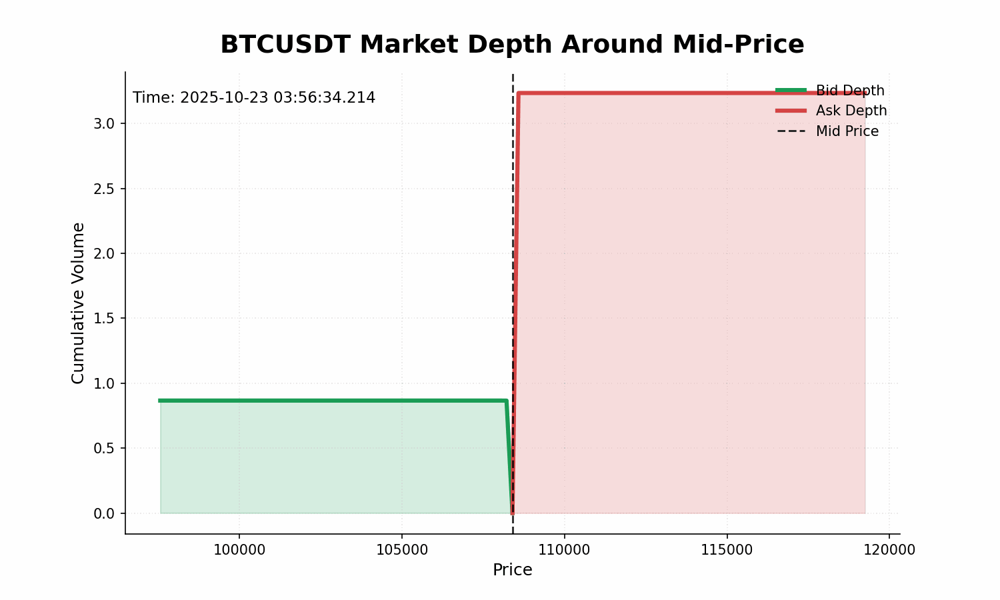

# Data Source
| Platform | Method | Category |Pairs| 
| ------------- | ------------- |------------- |------------- |
| Binance  | WebSocketAPI  | Tick to tick orderbook | BTCUSDT, ETHUSDT, ADAUSDT, LTCUSDT, SOLUSDT, DOGEUSDT,
WBTCUSDT, WETHUSDT|

| Parameter | Sample Data |
| ------------- | ------------- |
|BidData| [[108398.83, 0.56155], [108389.42, 0.30441], [108386.57, 0.0], [108277.25, 0.0], [108276.07, 0.0], [108098.83, 0.00011], [86719.07, 0.0]] |
|AskData| [[108398.84, 3.23111], [108408.05, 0.00406], [108489.27, 0.0]]|
|BidNumber|7|
|AskNumber|3|
|BestBidPrice|108398.83|
|BestAskPrice|108398.84|
|BestBidQuantity|0.56155|
|BestAskQuantity|0.0|
|Spread|0.00999999999476131|
|volatility| 306.2535762207123|
# Data Visualization

# Causal Relationship

| Treatments | Target |Method| Reference|
| ------------- | ------------- | ------------- | ------------- |
| log_return_BTCUSDT,BestAskPrice_ETHUSDT, BestBidPrice_ETHUSDT, log_return_ETHUSDT| log_return_ETHUSDT  | PCMCI+ | [Runge et al., 2020](https://arxiv.org/abs/2003.03685) |

Causal Precursors Data Flow & Logic Analysis：
| Phase | Core Method / Step | Input Shape & Type | Core Mechanism & Algorithm | Output Shape & Type | Downstream Utility |
| :--- | :--- | :--- | :--- | :--- | :--- |
| **1. Data Formatting** | `DataFrame(np.array(data))` | Raw time-series array Shape: `(Time_steps, Features)` | Encapsulates the NumPy array into Tigramite's native format to preserve temporal indices. | `data_processing.DataFrame` object | Standardizes the data interface for time-series conditional independence testing. |
| **2. Causal Testing** | `pcmci.run_pcmci()` | Tigramite DataFrame | Executes **PCMCI algorithm** with ParCorr: 1. **PC Phase**: Conditions out irrelevant parents. 2. **MCI Phase**: Eliminates spurious links via residual testing. | `self.pcmci.val_matrix` Shape: `(Features, Features, Window+1)` | Matrix values represent the **MCI test statistics (causal strengths)** at specific time lags. |
| **3. Significance Filtering** | `impact_matrix >= sig_thres` | Absolute causal strength matrix | 1. Selects target column (`-1`). 2. Loops through time lags $\tau \in [1, window]$. 3. Flags features exceeding `sig_thres`. | `link_matrix` Shape: `(Features, Features, Window+1)` (Boolean) | Filters out statistical noise, keeping only verified causal drivers. |
| **4. Temporal Grouping** | `group_causal_prescursors()` | `link_matrix` & `impact_matrix` | 1. Groups active drivers per lag `tau`. 2. Clears self-autoregressive links (`i != target_idx`). | `self.causal_link_groups` Format: Dict `{ "lag_str": [driver_id, ...] }` | Pinpoints exactly which external metrics trigger causal effects at distinct historical lags. |
| **5. Tree Structuring** | `get_group_trees()` | Grouped causal driver dictionary | Builds a 2-level causal topology tree for each lag: • Level 1: Target Variable • Level 2: Causal Drivers | 4 structured topology dicts: • `group_nodes` • `group_num_chid_nodes` • `group_input_idx` • `group_child_state_idx` | Transforms matrix outputs into **topology configurations** to feed **Causal LSTM (CLSTM)** networks. |

# CLSTM Implementation
Component Breakdown:
1. `NodeCell`
The fundamental building block of the model. Each node in the causal tree is represented by an individual `NodeCell`. 
* **Horizontal Forward (`_horizontal_forward`)**: Standard LSTM gating mechanism ($i, f, o, a$) to track the historical memory ($h, c$) of a specific feature over time.
* **Vertical Forward (`_vertical_forward`)**: A gated fusion mechanism that dynamically weighs and aggregates the spatial/structural influences ($n$) from its child causal nodes based on the current input context.

2. `CausalCell`
Manages a collection of `NodeCell`s representing a single snapshot of the entire causal topology at a specific time step.
* **Topological Sorting**: Loops through nodes based on the pre-computed tree structure.
* **Dynamic Dependency Injection**: Intercepts the hidden network states ($n$) from child nodes via `child_state_idx` and stacks them to feed the parent node's vertical forward pass.

3. `CLSTM`
The top-level sequence wrapper that stacks `CausalCell`s sequentially over the entire input time horizon (`input_len`). It maps the final causal state representation of the root node ($n_{root}$) via a dense layer to output the final prediction.

Network Data Flow & Internal Operations:

| Module | Core Phase / Operation | Input Tensors & Shapes | Gating & Computational Logic | Output Tensors & Shapes | Conceptual Purpose |
| :--- | :--- | :--- | :--- | :--- | :--- |
| **NodeCell** | Horizontal Memory | `inputs`: `[B, H]` `h_prev`/`c_prev`: `[B, H]` | $ifo = \sigma(W_{ifo}x + U_{ifo}h_{prev})$ $a = \tanh(W_ax + U_ah_{prev})$ $c = i \odot a + f \odot c_{prev}$ $h = o \odot \tanh(c)$ | `h`: `[B, H]` `c`: `[B, H]` | Captures pure temporal dependency and autoregressive memory for individual causal variables. |
| **NodeCell** | Vertical Influence | `child_n`: `[Num_Children, B, H]` (Optional) | $r_{child} = \sigma(W_rx + U_rh_{prev})$ $I_{neighborhood} = \sum (r_{child} \odot child\_n)$ $n_1, n_2 = \sigma(\text{Linear}(x, h_{prev}, h_{curr}))$ $n = n_1 \odot I_{neighborhood} + n_2 \odot h_{curr}$ | `n`: `[B, H]` | Aggregates causal impacts from downstream driver variables into the current parent node representation. |
| **CausalCell** | Structural Graph Loop | `inputs`: `[B, Total_Features]` | Iterates over `num_nodes`. Slices input features via `input_idx[i]` and extracts states from dependencies using `child_state_idx[i]`. | `n`/`h`/`c`: `[Num_Nodes, B, H]` | Synchronizes all causal nodes within a single time frame according to the topology configuration. |
| **CLSTM** | Sequence Recurrence | `inputs`: `[B, Input_Len, Total_Features]` | Initializes hidden states to $0$. Unrolls time sequence through `cell_stack` iteratively | `output`: `[B, 1]` | Models joint spatio-temporal causal dynamics and generates the final downstream target inference. |

*Note on Shapes: `B` = Batch Size, `H` = Hidden Dimension (`dim_hidden`).*

